# MicGuard

Prevents Bluetooth audio devices (e.g. AirPods) from hijacking the default macOS microphone.

<p align="center">
  <picture>
    <source media="(prefers-color-scheme: dark)" srcset="Resources/images/how-it-works-dark.svg">
    
  </picture>
</p>

> **Beta:** MicGuard is pre-1.0. Backward compatibility is not guaranteed until version 1.0.0 is reached.

## Requirements

- macOS 15+

## Install

```bash
brew install pszypowicz/tap/mic-guard
```

Release builds are signed with a Developer ID certificate and notarized, so Gatekeeper accepts them as-is.

### Direct download

Grab `MicGuard.dmg` from the [latest release](https://github.com/pszypowicz/MicGuard/releases/latest), open it, and drag MicGuard into Applications.

### Build from source

```bash
make install
```

## How it works

MicGuard is a macOS menubar app that monitors the default input device via CoreAudio. When the system switches the input (e.g. when AirPods connect), MicGuard immediately reverts to your preferred microphone.

On first launch the current input device becomes your preferred mic, and "Launch at Login" is enabled automatically. To disable MicGuard, quit the app.

Everything is configured in the Settings window, opened from the menu bar icon. The icon itself can be hidden there; reopening the app (Finder double-click, `open -a MicGuard`) always shows Settings, so that is the way back in when the icon is hidden.

### Features

- **Menubar app** - runs silently in the background with a shield+mic icon (hideable in Settings)
- **Auto-revert** - reverts unwanted input device switches caused by Bluetooth connections
- **Self-contained** - no config files, no CLI; settings live in macOS defaults

## Modes

MicGuard has two device enforcement modes, switchable in Settings:

### Auto (default)

Protects your preferred mic during device connect/disconnect events. If you switch the input device in System Settings after devices have settled, MicGuard recognizes this as intentional and saves the new choice as your preferred mic.

### Manual

Always reverts to your chosen preferred device, no matter when or why the switch happened. Turn off Auto Mode in Settings to pick a device.

## Configuration

All settings live in macOS defaults under the `cz.szypowi.micguard` domain:

| Key               | Purpose                                                                                 |
| ----------------- | --------------------------------------------------------------------------------------- |
| `preferredDevice` | Exact name of your preferred input device                                               |
| `mode`            | `auto` or `manual` - device enforcement strategy (default: `auto`)                      |
| `settleSeconds`   | Seconds to wait before accepting a device switch as user-initiated (1-30, default: `2`) |
| `showMenuBarIcon` | Show the menu bar icon (default: `true`); changes apply live                            |

```bash
defaults read cz.szypowi.micguard                          # inspect
defaults write cz.szypowi.micguard settleSeconds -float 5  # tune settle period (no UI)
defaults delete cz.szypowi.micguard                        # reset everything
```

## Status broadcast

For personal integrations (e.g. SketchyBar), MicGuard posts read-only telemetry. There is no way to control or query MicGuard externally - it only tells:

- `cz.szypowi.micguard.statusChanged` - distributed notification posted on startup and whenever the current input device or its muted state changes; userInfo: `device` (name), `muted` (`"true"`/`"false"` - volume 0 or hardware mute flag)

## Debugging

MicGuard logs to the unified logging system with subsystem `cz.szypowi.micguard`:

```bash
log stream --predicate 'subsystem == "cz.szypowi.micguard"' --level debug           # follow live
log show --predicate 'subsystem == "cz.szypowi.micguard"' --last 1h --info --debug  # past logs
```

In fish, `log` is a builtin - use `/usr/bin/log`.

Notes:

- When a Bluetooth device connects or disconnects, CoreAudio fires `DEVICE_LIST_CHANGED` and `DEFAULT_INPUT_CHANGED` two or three times per event. Duplicate log lines are normal macOS behavior; the handlers are idempotent.
- Running the raw binary (`/Applications/MicGuard.app/Contents/MacOS/MicGuard`) bypasses the `LSMultipleInstancesProhibited` duplicate-instance check - quit the running instance first. Logs go to the unified log, not stderr.
- Development loop: `make dev` builds the bundle and (re)launches it, `make dev-stop` kills it.

Common issues:

- **Preferred mic not found** - if the preferred device is disconnected, MicGuard keeps monitoring and switches back when it reconnects.
- **Login item not starting** - check System Settings → General → Login Items; re-toggle "Launch at Login" in MicGuard's Settings.
- **Reset** - `defaults delete cz.szypowi.micguard`, then relaunch; the current input device becomes the preferred mic again.

## License

MIT
