<div align="center">
  
</div>

# MicGuard

Prevents Bluetooth audio devices (e.g. AirPods) from hijacking the default macOS microphone.

> **Beta:** MicGuard is pre-1.0. Backward compatibility is not guaranteed until version 1.0.0 is reached.

## Requirements

- macOS 15+

## Install

```bash
brew install pszypowicz/tap/mic-guard
```

### Build from source

```bash
make install
```

## How it works

MicGuard is a macOS menubar app that monitors the default input device via CoreAudio. When the system switches the input (e.g. when AirPods connect), MicGuard immediately reverts to your preferred microphone.

On first launch the current input device becomes your preferred mic. You can change it anytime from Settings or with `mic-guard set`.

### Features

- **Menubar daemon** - runs silently in the background with a shield+mic icon
- **Auto-revert** - reverts unwanted input device switches caused by Bluetooth connections
- **Mute / volume control** - toggle mute and set input volume via CLI
- **CLI tool** - `mic-guard` binary for scripting (`list`, `set`, `enable`, `toggle`, `mute`, `volume`, etc.)
- **Distributed notifications** - real-time status broadcasts for custom integrations

## Demo

AirPods connecting hijacks your input device. MicGuard reverts it instantly.

<p align="center">
  
</p>

## Modes

MicGuard has two device enforcement modes, configurable in Settings or via `mic-guard set`:

### Auto (default)

Protects your preferred mic during device connect/disconnect events. If you switch the input device in System Settings after devices have settled, MicGuard recognizes this as intentional and saves the new choice as your preferred mic.

### Manual

Always reverts to your chosen preferred device, no matter when or why the switch happened. To change the preferred device you must explicitly select it in Settings or run `mic-guard set <name>`.

## Documentation

See the full docs at **[pszypowicz.github.io/MicGuard](https://pszypowicz.github.io/MicGuard/)** - covering [CLI reference](https://pszypowicz.github.io/MicGuard/cli.html), [debugging](https://pszypowicz.github.io/MicGuard/debugging.html), [integrations](https://pszypowicz.github.io/MicGuard/integrations.html), [notifications](https://pszypowicz.github.io/MicGuard/notifications.html), and [releasing](https://pszypowicz.github.io/MicGuard/releasing.html).

## License

MIT
