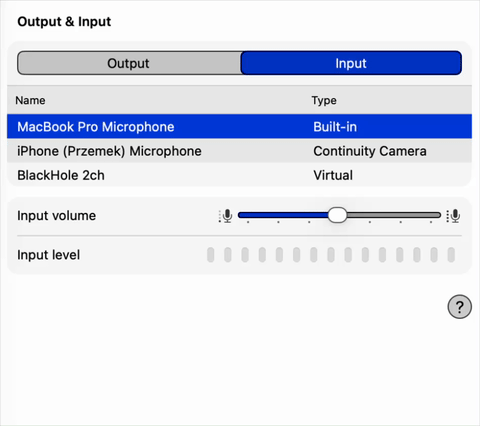

# MicGuard

Prevents Bluetooth audio devices (e.g. AirPods) from hijacking the default macOS microphone.

[CLI Reference](cli.md) · [Debugging](debugging.md) · [Integrations](integrations.md) · [Notifications](notifications.md) · [Releasing](releasing.md)

> **Beta:** MicGuard is pre-1.0. Backward compatibility is not guaranteed until version 1.0.0 is reached.

## Demo

AirPods connecting hijacks your input device. MicGuard reverts it instantly.

| MicGuard disabled | MicGuard enabled |
|---|---|
|  |  |

## How it works

MicGuard is a macOS menubar app that registers a CoreAudio property listener on the default input device. When the system switches the input (e.g. when AirPods connect), MicGuard immediately reverts to your preferred microphone using native CoreAudio APIs.

The preferred mic is stored in `~/.config/mic-guard/preferred-mic`. If the file doesn't exist on first run, MicGuard initializes it with the current input device. The CLI (`mic-guard`) performs direct CoreAudio calls and config writes, then posts a `requestStatus` distributed notification so the daemon re-reads state and broadcasts `statusChanged`. MicGuard automatically enables "Launch at Login" on first install. You can toggle it off in Settings or System Settings → Login Items.

## Requirements

- macOS 15+

## Install

```bash
brew install pszypowicz/tap/mic-guard
```

Or build from source:

```bash
make install    # builds .app bundle, copies to /Applications, symlinks mic-guard CLI
```

## Menubar

Click the shield+mic icon in the menubar to:

- Toggle MicGuard on/off
- Open Settings (preferred device, mode, launch at login, settle period)
- View About MicGuard
- Quit the app

## Configuration

All config lives in `~/.config/mic-guard/`:

| File | Purpose |
|------|---------|
| `preferred-mic` | Exact name of your preferred input device |
| `enabled` | `1` or `0` — whether MicGuard is active |
| `mode` | `auto` or `manual` — device enforcement strategy (default: `auto`) |
| `settle-seconds` | Seconds to wait before accepting a device switch as user-initiated (1–30, default: `2`; the Settings UI slider caps at 10) |
| `lock` | `fcntl` advisory lock file — prevents duplicate daemon instances (kernel-managed, no manual cleanup needed) |
